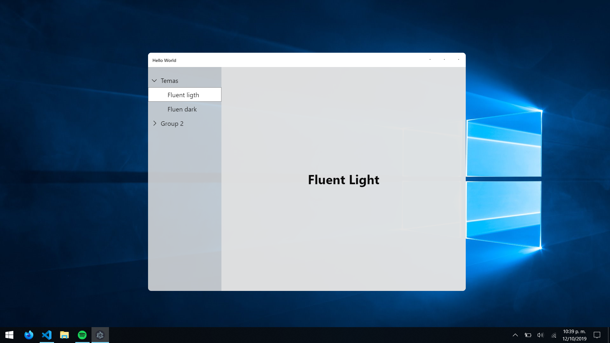
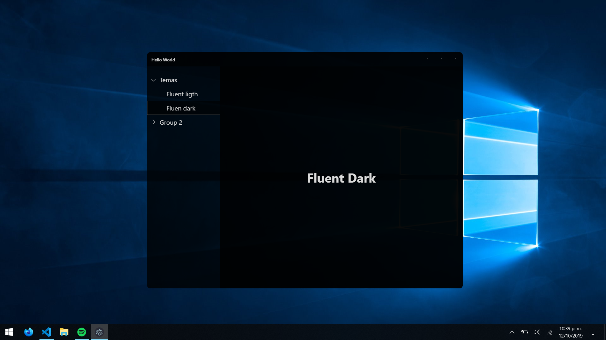

# listView.js
## Temas tipo Fluent Design

    .fluent_light


    .fluent_dark


## ThemeCreator
```scss
//Funcion para crear temas para este tipo de frames
@mixin createtheme($name, $arrow_icon, $transition, $colors);

//Fluent Light
@include createTheme('fluent_light', url("../ico/black_arrow.png"), .5s ease-in-out,
    $transparentbg:#e2e2e2d7,
    $solidbg: #FFFFFF,
    $fontc: #0a0a0a
);

//Fluent Dark
@include createTheme('fluent_dark', url("../ico/white_arrow.png"), .5s ease-in-out,
    $transparentbg:#000000cb,
    $solidbg: #000000a0,
    $fontc: #DADADA
);
```
## Estructura
```html
<body class="$theme">
    <div class="main">
        <div class="header">
            <div class="title">Hello World</div>
            <span></span>
            <div class="buttons">
                <div class="btn" id="min">.</div>
                <div class="btn" id="min-max">.</div>
                <div class="btn" id="close">.</div>
            </div>
        </div>
        <div class="content">
            <div class="listView">
                <div class="optionGroup">
                    <div class="title">
                        <div class="arrow"></div>
                        <div class="text">Temas</div>
                    </div>
                    <div class="option" id="light">Fluent ligth</div>
                    <div class="option" id="dark">Fluen dark</div>
                </div>
            </div>
        </div>
    </div>
</div>
```
## Script
```js
        let j = 0;
        let listView = document.querySelector('.listView')
        listView.childNodes.forEach(element => {
            element.addEventListener('click', (e)=>{
                if(element.classList.contains('close'))
                    element.classList.remove('close')
                else
                    element.classList.add('close')
            })

            let i = 1;

            element.childNodes.forEach(subelement =>{
                if(subelement.className == 'option'){
                    subelement.group = j;
                    subelement.value = i++;
                    subelement.addEventListener('click', (e)=>{
                        e.preventDefault()
                        e.stopPropagation()
                        // document.querySelector('.content .main').innerHTML = `Option ${subelement.group}_${subelement.value}`
                    })
                }else if(subelement.className == 'title')j++;
            })
        })
``` 